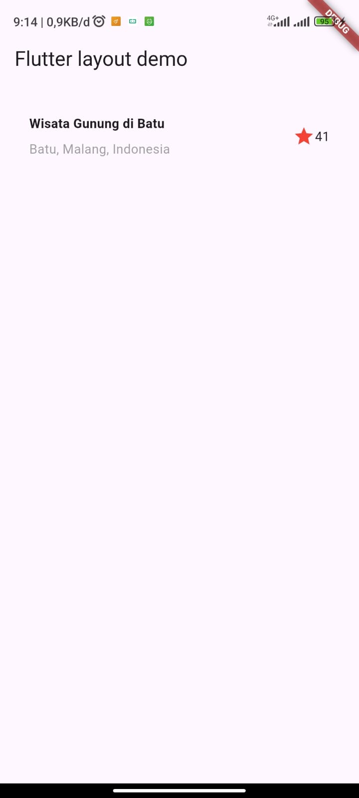
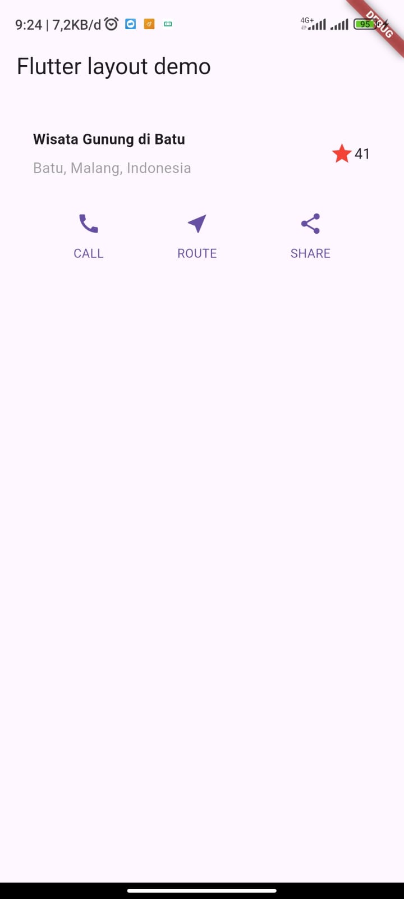
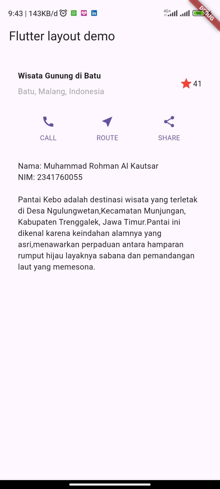
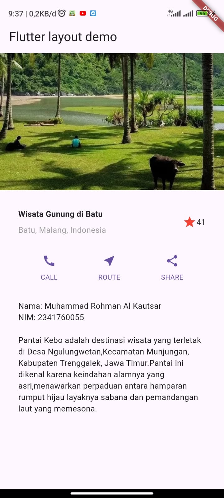

#### Nama: Muhammad Rohman Al Kautsar  
#### NIM : 2341760055  

# 🚀 Layout Flutter App  

Proyek ini merupakan aplikasi Flutter sederhana untuk mempelajari dasar-dasar layouting Flutter  

---

## 📸 Screenshot Perkembangan  

### 1️⃣ Membangun Layout Flutter 
Pada tahap awal, membuat layouting untuk flutter.  

  

---

### 2️⃣ Implementasi button row  
Selanjutnya, membuat button section

  

---

### 3️⃣ Implementasi text section  
Pada tahap ini, aplikasi ditambahkan text section

  

---

### 4️⃣ Implementasi image section
Pada tahap ini, aplikasi ditambahkan image section

  

